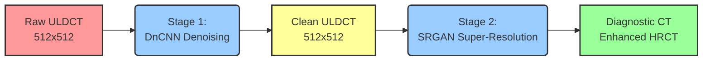

# 2-Stage Medical CT Enhancement Pipeline: ULDCT to Diagnostic Quality


## 📌 Project Overview

This project presents a **2-Stage 2D Medical CT Enhancement Pipeline** designed to tackle the severe noise and blur inherent in Ultra-Low-Dose CT (ULDCT) scans of COVID-19 patients. 

ULDCT scans are significantly safer for patients due to reduced radiation exposure, but they suffer from severe quantum mottle (radiation noise) and degraded spatial resolution. This pipeline effectively cleans and sharpens these images to restore them to diagnostic quality using a combined approach of Deep Convolutional Neural Networks (DnCNN) and Super-Resolution Generative Adversarial Networks (SRGAN).



## 🧠 System Architecture

### Stage 1: Denoising (DnCNN)
*   **Purpose:** To extract and remove the quantum mottle/radiation static from raw ULDCT scans.
*   **Architecture:** A 17-layer Residual Network (DnCNN) that learns the residual noise rather than the clean image. 
*   **Input:** Raw, noisy ULDCT slices (normalized to `0.0 - 1.0`, `512x512` spatial dimension).

### Stage 2: Super-Resolution (SRGAN)
*   **Purpose:** To sharpen the denoised scans and recover lost spatial details.
*   **The "Self-Degradation" Strategy:** Because we lack paired High-Resolution (HRCT) ground truths for this specific dataset, we utilize a self-supervised/self-degradation approach. The DataLoader takes the physically clean `512x512` outputs from the DnCNN, mathematically degrades them down to `256x256` via bicubic downsampling, and trains the Generator (SRResNet with PixelShuffle) to hallucinate them back to the original `512x512` resolution.
*   **Loss Functions:** The SRGAN is trained using a composite loss function to ensure perceptual quality:
    *   *Content Loss:* Mean Squared Error (MSE)
    *   *Adversarial Loss:* Binary Cross-Entropy (BCE) via the Discriminator.
    *   *Perceptual Loss:* Feature extraction using a frozen VGG-19 network to ensure the hallucinated textures are biologically authentic.

## ⚡ Hardware & Optimizations

This pipeline is aggressively optimized for modern NVIDIA GPUs (e.g., RTX 40-series, RTX 6000 Ada) to process massive 3D volumetric data efficiently:
*   **Mixed Precision:** Utilizes `torch.bfloat16` for near-lossless memory reduction and massive speedups during both training and batch inference.
*   **Tensor Cores:** Globally enabled `TF32` matrix multiplications for accelerated deep learning computations.

**Requirements:**
```bash
pip install torch torchvision numpy tqdm
```

## 📂 Dataset Preparation

The pipeline is built around the **IEEE COVID-19 LDCT/ULDCT dataset**, featuring 104 COVID-19 cases and 56 Normal cases sourced from Iran. 

Before feeding into the pipeline, the raw volumes must be strictly preprocessed, primarily utilizing the notebooks in the `Preprocessing/` folder (e.g., `pp_step1.ipynb`, `pp_step3.ipynb`):
1.  **HU Windowing:** Clipped to a specific lung-tissue Hounsfield Unit window.
2.  **Normalization:** Min-Max scaled strictly to the `[0.0, 1.0]` range.
3.  **Padding/Cropping:** Spatially adjusted to perfectly fit `512x512` axial slices.
4.  **Format:** Saved structurally as 3D NumPy arrays (`.npy`).

## 🚀 Usage Pipeline (Step-by-Step)

### Step 1: Train the Denoising Network
Navigate to the `dncnn/` directory and execute the training notebook to train the 17-layer DnCNN model on your preprocessed `.npy` volumes.
*   **Script:** `dncnn/train_dncnn_2d.ipynb`

### Step 2: Batch Inference for Denoised Dataset
Once the DnCNN is trained (or using the provided checkpoint), run the batch inference script. This iteratively loads the raw `.npy` patient volumes, processes them slice-by-slice using `bfloat16`, and outputs the physically clean volumes.
*   **Script:** `dncnn/generate_denoised_dataset.py`
*   **Target Output:** Generates a set of clean `.npy` files inside an output directory like `Denoised_Outputs/` or `Denoised_COVID/`.

### Step 3: Train and Evaluate the SRGAN
Using the clean `Denoised_Outputs`, train the Super Resolution GAN to recover edge fidelity using the "Self-Degradation" dataloader mechanism.
*   **Training Script:** `srgan/train_srgan_2d.ipynb` *(Run the SRGAN training routine)*
*   **Evaluation:** Use the evaluation notebooks (`srgan_evaluate_checkpoint_COVID.ipynb` and `srgan_evaluate_checkpoint_NORMAL.ipynb`) inside the `srgan/` folder to numerically and visually validate your GAN checkpoints.

## 📊 Results & Checkpoints

> **Note:** *This section is a placeholder for empirical results and visual examples.*

### Performance Metrics 
| Model Stage        | PSNR (dB) | SSIM | LPIPS |
| :---               | :---:     | :---: | :---: |
| Stage 1 (DnCNN)    | TBD       | TBD   | TBD   |
| Stage 2 (SRGAN)    | TBD       | TBD   | TBD   |

### Visual Examples
*(Placeholder for BEFORE / MIDDLE / AFTER comparison images demonstrating the pipeline's performance)*

---
*Developed for advanced Medical AI image reconstruction.*
